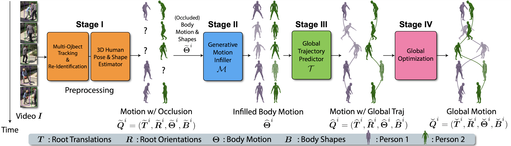

# GLAMR


This repo contains the official PyTorch implementation of our paper:
  
GLAMR: Global Occlusion-Aware Human Mesh Recovery with Dynamic Cameras  
[Ye Yuan](https://www.ye-yuan.com/), [Umar Iqbal](http://www.umariqbal.info/), [Pavlo Molchanov](https://research.nvidia.com/person/pavlo-molchanov/), [Kris Kitani](http://www.cs.cmu.edu/~kkitani/), [Jan Kautz](https://jankautz.com/)  
**CVPR 2022 (Oral)**  
[website](https://nvlabs.github.io/GLAMR) | [paper](https://arxiv.org/abs/2112.01524) | [video](https://youtu.be/wpObDXcYueo)

# Overview


# News
- **[08/10/22]**: [Demos](#multi-person-videos) for multi-person videos are added (Thanks to [Haofan Wang](https://haofanwang.github.io/))!
- **[08/01/22]**: [Demos](#demo) for dynamic and static videos are released!

# Table of Content
- [Installation](#installation)
- [Demo](#demo)
    - [Dynamic Videos](#dynamic-videos)
    - [Static Videos](#static-videos)
    - [Multi-Person Videos](#multi-person-videos)
- [Datasets](#datasets)
- [Motion Infiller](#motion-infiller)
- [Evaluation](#evaluation)
- [Trajectory Predictor](#trajectory-predictor)
- [Joint Motion Infiller and Trajectory Predictor](#joint-motion-infiller-and-trajectory-predictor)
- [Citation](#citation)

# Installation 

### Environment
* **Tested OS:** MacOS, Linux
* Python >= 3.7
* PyTorch >= 1.8.0
* [HybrIK](https://github.com/Jeff-sjtu/HybrIK) (used in demo)

### Dependencies
1. Clone this repo recursively:
    ```
    git clone --recursive https://github.com/NVlabs/GLAMR.git
    ```
    This will fetch the submodule [HybrIK](https://github.com/Jeff-sjtu/HybrIK).
2. Follow HybrIK's installation [instructions](https://github.com/Jeff-sjtu/HybrIK#installation-instructions) and download its [models](https://github.com/Jeff-sjtu/HybrIK#download-models).
2. Install [PyTorch 1.8.0](https://pytorch.org/get-started/previous-versions/) with the correct CUDA version.
3. Install system dependencies (Linux only):
    ```
    source install.sh
    ```
4. Install python dependencies:
    ```
    pip install -r requirements.txt
    ```
5. Download [SMPL](https://smpl.is.tue.mpg.de/) models & joint regressors and place them in the `data` folder. You can obtain the model following [SPEC](https://github.com/mkocabas/SPEC)'s instructions [here](https://github.com/mkocabas/SPEC/blob/master/scripts/prepare_data.sh).

### Pretrained Models
* You can download [third-party](https://github.com/YanglanOu) pretrained models from [Google Drive](https://drive.google.com/file/d/1_3h0DExyHkPH9cv1O8Y42YPI3c08G-2b/view?usp=sharing) or [BaiduYun](https://pan.baidu.com/s/1nvSzfuffB5yBaZ3GRBDC5w?pwd=pj3z).
* Once the `glamr_models.zip` file is downloaded, unzipping it will create the `results` folder:
  ```
  unzip glamr_models.zip
  ```
  Note that the pretrained models directly correspond to the config files for the [motion infiller](motion_infiller/cfg) and [trajectory predictor](traj_pred/cfg).

# Demo

We provide demos for single- and multi-person video with both dynamic and static cameras.
### Dynamic Videos
Run the following command to test GLAMR on a single-person video with **dynamic** camera:
```
python global_recon/run_demo.py --cfg glamr_dynamic \
                                --video_path assets/dynamic/running.mp4 \
                                --out_dir out/glamr_dynamic/running \
                                --save_video
```
This will output results to `out/glamr_dynamic/running`. Results videos will be saved to `out/glamr_dynamic/running/grecon_videos`. Additional dynamic test videos can be found in [assets/dynamic](assets/dynamic). More video comparison with [HybrIK](https://github.com/Jeff-sjtu/HybrIK) are available [here](https://drive.google.com/drive/folders/1BCkIBZGgDox_bMZUxHD--s0eK-ded4J7?usp=sharing).


### Static Videos
Run the following command to test GLAMR on a single-person video with **static** camera:
```
python global_recon/run_demo.py --cfg glamr_static \
                                --video_path assets/static/basketball.mp4 \
                                --out_dir out/glamr_static/basketball \
                                --save_video
```
This will output results to `out/glamr_static/basketball`. Results videos will be saved to `out/glamr_static/basketball/grecon_videos`. Additional static test videos can be found in [assets/static](assets/static). More video comparison with [HybrIK](https://github.com/Jeff-sjtu/HybrIK) are available [here](https://drive.google.com/drive/folders/1B9q_tczSpb62ozL1iMGe9If2XEKQ3xnE?usp=sharing).


### Multi-Person Videos
Use the `--multi` flag and the `glamr_static_multi` config in the above demos to test GLAMR on a **multi-person** video:
```
python global_recon/run_demo.py --cfg glamr_static_multi \
                                --video_path assets/static/basketball.mp4 \
                                --out_dir out/glamr_static_multi/basketball \
                                --save_video \
                                --multi
```
This will output results to `out/glamr_static_multi/basketball`. Results videos will be saved to `out/glamr_static_multi/basketball/grecon_videos`.


# Datasets
We use three datasets: [AMASS](https://amass.is.tue.mpg.de/), [3DPW](https://virtualhumans.mpi-inf.mpg.de/3DPW/), and Dynamic [Human3.6M](http://vision.imar.ro/human3.6m). Please download them from the official website and place them in the `dataset` folder with the following structure:
```
${GLAMR_ROOT}
|-- datasets
|   |-- 3DPW
|   |-- amass
|   |-- H36M
```


# Evaluation
First, run GLAMR on the test set of the dataset you want to evaluate. For example, to run GLAMR on the 3DPW test set:
```
python global_recon/run_dataset.py --dataset 3dpw --cfg glamr_3dpw --out_dir out/3dpw
```
Next, evaluate the results generated by GLAMR:
```
python global_recon/eval_dataset.py --dataset 3dpw --results_dir out/3dpw
```
Similarly, to evaluate on Dynamic Human3.6M, you can replace the `3dpw` to `h36m` for the dataset and config.


### AMASS
The following command processes the original [AMASS](https://amass.is.tue.mpg.de/) dataset into a processed version used in the code:
```
python preprocess/preprocess_amass.py
```

### 3DPW
The following command processes the original [3DPW](https://virtualhumans.mpi-inf.mpg.de/3DPW/) dataset into a processed version used in the code:
```
python preprocess/preprocess_3dpw.py
```

### Dynamic Human3.6M
Please refer to this [doc](docs/prepare_dynamic_h36m.md) for generating the Dynamic Human3.6M dataset.


# Motion Infiller
To **train** the motion infiller:
```
python motion_infiller/train.py --cfg motion_infiller_demo --ngpus 1
```
where we use the config [motion_infiller_demo](motion_infiller/cfg/motion_infiller_demo.yml).

---

To **visualize** the trained motion infiller on test data:
```
python motion_infiller/vis_motion_infiller.py --cfg motion_infiller_demo --num_seq 5
```
where `num_seq` is the number of sequences to visualize. This command will save results videos to `out/vis_motion_infiller`.

# Trajectory Predictor
To **train** the trajectory predictor:
```
python traj_pred/train.py --cfg traj_pred_demo --ngpus 1
```
where we use the config [traj_pred_demo](traj_pred/cfg/traj_pred_demo.yml).

---

To **visualize** the trained trajectory predictor on test data:
```
python traj_pred/vis_traj_pred.py --cfg traj_pred_demo --num_seq 5
```
where `num_seq` is the number of sequences to visualize. This command will save results videos to `out/vis_traj_pred`.

# Joint Motion Infiller and Trajectory Predictor
For ease of use, we also define a joint (wrapper) model of motion infiller and trajectory predictor, i.e., the model merges the motion infilling and trajectory prediction stages. [The joint model](motion_infiller/models/motion_traj_joint_model.py) composes of pretrained motion infiller and trajectory predictor and is just a convenient abstraction. We can define the joint model using config files such as [joint_motion_traj_demo](motion_infiller/cfg_infer/joint_motion_traj_demo.yml). *The joint model will also be used in the global optimization stage.*

---

To **visualize** the joint model's results:
```
python motion_infiller/vis_motion_traj_joint_model.py --cfg joint_motion_traj_demo --num_seq 5
```
where `num_seq` is the number of sequences to visualize. This command will save results videos to `out/vis_motion_traj_joint_model`.

# Citation
If you find our work useful in your research, please cite our paper [GLAMR](https://nvlabs.github.io/GLAMR):
```bibtex
@inproceedings{yuan2022glamr,
    title={GLAMR: Global Occlusion-Aware Human Mesh Recovery with Dynamic Cameras},
    author={Yuan, Ye and Iqbal, Umar and Molchanov, Pavlo and Kitani, Kris and Kautz, Jan},
    booktitle={Proceedings of the IEEE/CVF Conference on Computer Vision and Pattern Recognition (CVPR)},
    year={2022}
}
```

# License
Please see the [license](LICENSE) for further details.
